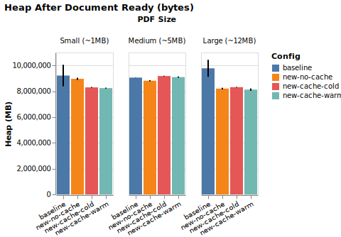
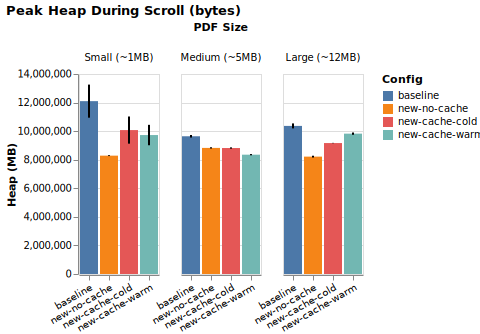
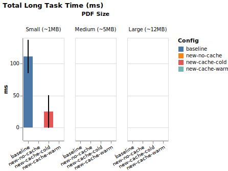
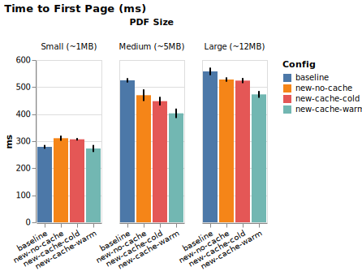

# PDF Viewer Performance Report

## Environment

| Field | Value |
|-------|-------|
| Date | 2026-06-25 |
| Profile | **full** (10 iterations, full-document scroll, all 3 PDFs) |
| Platform | darwin x64 |
| Browser | Version 1.61.1 |
| Viewport | 1440×900 |
| Iterations | 10 (first discarded as warmup) |
| PDFs | sample_1.pdf (~1 MB), sample_2.pdf (~5 MB), sample.pdf (~12 MB) |

---

## Headline Deltas (Time to First Page)

| PDF | Mozilla baseline | Custom no-cache | vs Baseline | Cold → Warm (cache speedup) |
|-----|-----------------|-----------------|-------------|------------------------------|
| Small | 279ms | 311ms | 11% | 307ms → 273ms (warm speedup: -11%) |
| Medium | 525ms | 470ms | -10% | 448ms → 403ms (warm speedup: -10%) |
| Large | 558ms | 528ms | -5% | 524ms → 473ms (warm speedup: -10%) |

---

## Time to First Page (ms)

| Config | Small | Medium | Large |
|--------|-------|-------|-------|
| Mozilla (baseline) | 279ms | 525ms | 558ms |
| Custom, no cache | 311ms | 470ms | 528ms |
| Custom, cache cold | 307ms | 448ms | 524ms |
| Custom, cache warm | 273ms | 403ms | 473ms |

## Peak Heap During Scroll

| Config | Small | Medium | Large |
|--------|-------|-------|-------|
| Mozilla (baseline) | 11.5 MB | 9.2 MB | 9.9 MB |
| Custom, no cache | 7.9 MB | 8.4 MB | 7.8 MB |
| Custom, cache cold | 9.6 MB | 8.4 MB | 8.7 MB |
| Custom, cache warm | 9.3 MB | 8.0 MB | 9.4 MB |

## Heap After Document Ready

| Config | Small | Medium | Large |
|--------|-------|-------|-------|
| Mozilla (baseline) | 8.8 MB | 8.6 MB | 9.3 MB |
| Custom, no cache | 8.5 MB | 8.4 MB | 7.8 MB |
| Custom, cache cold | 7.9 MB | 8.8 MB | 7.9 MB |
| Custom, cache warm | 7.9 MB | 8.7 MB | 7.8 MB |

## Total Long Task Time (ms)

| Config | Small | Medium | Large |
|--------|-------|-------|-------|
| Mozilla (baseline) | 111ms | 0ms | 0ms |
| Custom, no cache | 0ms | 0ms | 0ms |
| Custom, cache cold | 25ms | 0ms | 0ms |
| Custom, cache warm | 0ms | 0ms | 0ms |

---

## Charts

---

## Methodology & Caveats

- **Custom viewer marks**: `performance.mark` at `pdf-load-start` (top of `load()`), `first-page-rendered` (after `renderers[0].render()`), `document-ready` (after `_startRenderPipeline`).
- **Mozilla viewer**: instrumented directly in `viewer.mjs` with the same marks as the custom viewer — `pdf-load-start` (top of `open()`, immediately before `getDocument`) and `first-page-rendered` (page 1's canvas finished drawing), with `timeToFirstPage` = the `time-to-first-page` measure between them. This is the same load-start → first-page-painted window the custom viewer reports, so the comparison is apples-to-apples (no DOM/MutationObserver proxy, and Mozilla's bundle-bootstrap time is excluded just as the custom viewer's module-load time is).
- **Cold runs**: HTTP cache bypassed via `Cache-Control: no-store` header; `viewer.clearCache()` called to discard in-memory canvas cache.
- **Warm runs**: one priming load performed and discarded before the 10 measured iterations.
- **Scroll pattern**: top → bottom in 500px steps with 300ms pauses → back to top. Identical across all configs.
- The new viewer renders lazily by design; its "time to document ready" reflects the first render pipeline start, not all-pages rendered.
