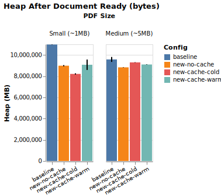
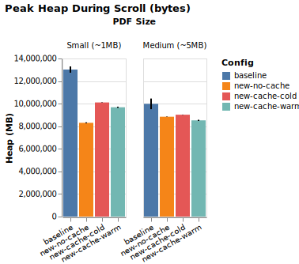
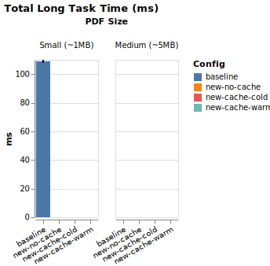
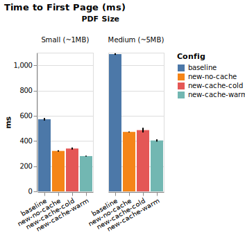

# PDF Viewer Performance Report

## Environment

| Field | Value |
|-------|-------|
| Date | 2026-06-25 |
| Profile | **quick** (5 iterations, scroll capped to ~40 steps, large PDF skipped) — for fast iteration, not the headline report |
| Platform | darwin x64 |
| Browser | Version 1.61.1 |
| Viewport | 1440×900 |
| Iterations | 5 (first discarded as warmup) |
| PDFs | sample_1.pdf (~1 MB), sample_2.pdf (~5 MB) |

---

## Headline Deltas (Time to First Page)

| PDF | Mozilla baseline | Custom no-cache | vs Baseline | Cold → Warm (cache speedup) |
|-----|-----------------|-----------------|-------------|------------------------------|
| Small | 572ms | 321ms | -44% | 340ms → 280ms (warm speedup: -18%) |
| Medium | 1089ms | 472ms | -57% | 486ms → 404ms (warm speedup: -17%) |
| Large | n/a | n/a | n/a | n/a → n/a (warm speedup: n/a) |

---

## Time to First Page (ms)

| Config | Small | Medium | Large |
|--------|-------|-------|-------|
| Mozilla (baseline) | 572ms | 1089ms | n/a |
| Custom, no cache | 321ms | 472ms | n/a |
| Custom, cache cold | 340ms | 486ms | n/a |
| Custom, cache warm | 280ms | 404ms | n/a |

## Peak Heap During Scroll

| Config | Small | Medium | Large |
|--------|-------|-------|-------|
| Mozilla (baseline) | 12.4 MB | 9.5 MB | n/a |
| Custom, no cache | 7.9 MB | 8.4 MB | n/a |
| Custom, cache cold | 9.6 MB | 8.6 MB | n/a |
| Custom, cache warm | 9.2 MB | 8.1 MB | n/a |

## Heap After Document Ready

| Config | Small | Medium | Large |
|--------|-------|-------|-------|
| Mozilla (baseline) | 10.5 MB | 9.1 MB | n/a |
| Custom, no cache | 8.6 MB | 8.4 MB | n/a |
| Custom, cache cold | 7.8 MB | 8.9 MB | n/a |
| Custom, cache warm | 8.7 MB | 8.7 MB | n/a |

## Total Long Task Time (ms)

| Config | Small | Medium | Large |
|--------|-------|-------|-------|
| Mozilla (baseline) | 109ms | 0ms | n/a |
| Custom, no cache | 0ms | 0ms | n/a |
| Custom, cache cold | 0ms | 0ms | n/a |
| Custom, cache warm | 0ms | 0ms | n/a |

---

## Charts

---

## Methodology & Caveats

- **Custom viewer marks**: `performance.mark` at `pdf-load-start` (top of `load()`), `first-page-rendered` (after `renderers[0].render()`), `document-ready` (after `_startRenderPipeline`).
- **Mozilla viewer**: cannot be instrumented — `timeToFirstPage` is measured as time until first `<canvas>` appears in the iframe DOM (MutationObserver proxy). This is slightly later than actual first paint.
- **Cold runs**: HTTP cache bypassed via `Cache-Control: no-store` header; `viewer.clearCache()` called to discard in-memory canvas cache.
- **Warm runs**: one priming load performed and discarded before the 5 measured iterations.
- **Scroll pattern**: top → bottom in 500px steps with 300ms pauses → back to top. Identical across all configs.
- The new viewer renders lazily by design; its "time to document ready" reflects the first render pipeline start, not all-pages rendered.
